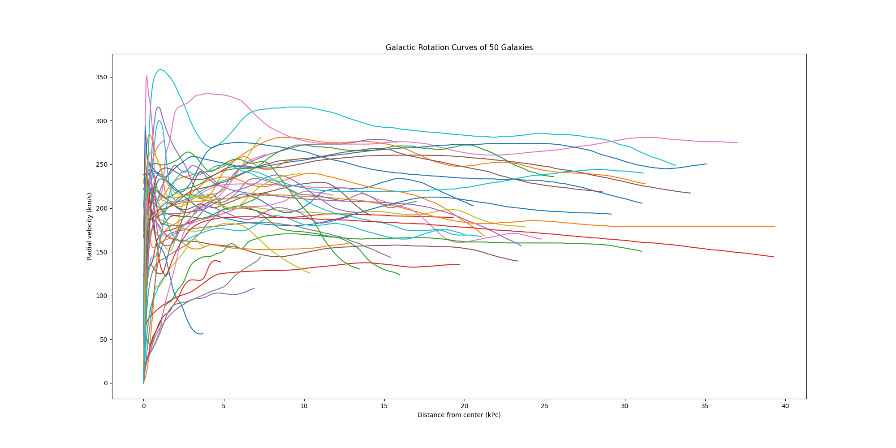
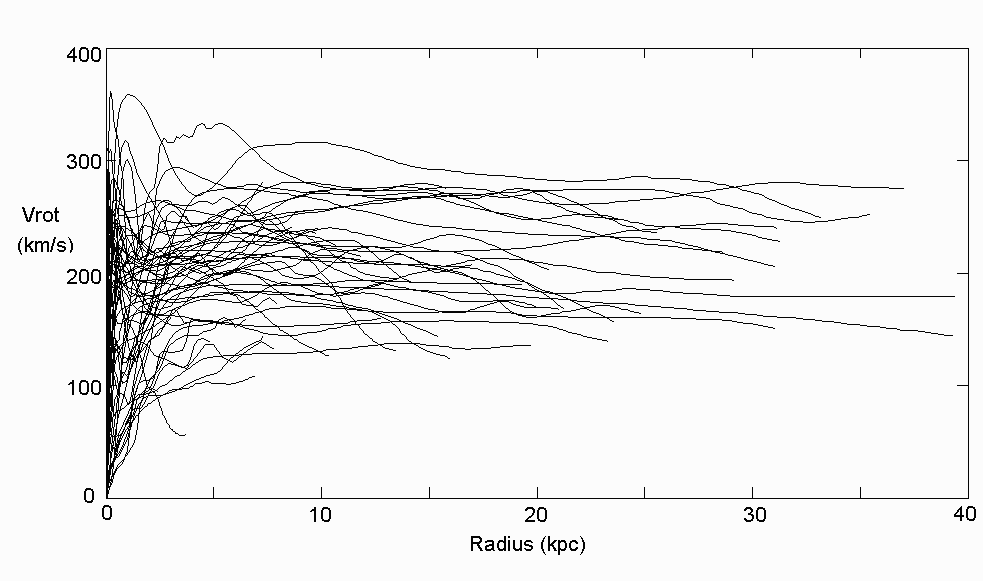

# Dark Matter Galactic Rotation Curve Analysis

Project to analyze data of rotation rates of different galactic regions for a set of 50 galaxies. So far the analysis has been restricted to visualizing the rotation curves in order to observe the constant radial velocities at far away distances from the galactic center, which is the behavior that gave rise to the prediction of dark matter.

## Data

Raw data for Distance from Galactic Center in kPc and Radial Velocity in km/s was obtained from:

- http://www.ioa.s.u-tokyo.ac.jp/~sofue/h-rot.htm
- http://www.ioa.s.u-tokyo.ac.jp/~sofue/rotation/data.htm

## Result

The plot obtained from my visualization is:

And the original result (located at: http://www.ioa.s.u-tokyo.ac.jp/~sofue/rotation/fig1/all-new.gif) from the research conducted on this is:

